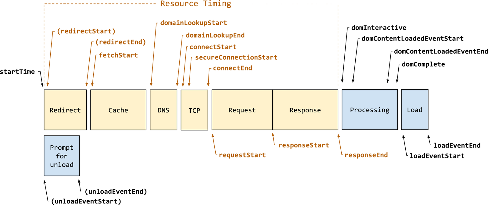

# Web重要性能指标

讨论网页性能的话题，经常会看到这种描述：页面加载时长x.xx秒。这种描述没有明确「页面加载」是属于页面生命周期哪个节点。而且大众对「页面加载」又有两种理解：`window.onload`或`DOMContentLoaded`。

Web页面生命周期有很多环节，而且浏览器对重要环节都做了UI反馈给用户，用户心智上逐渐对不同环节有不同的预期。所以一个指标不能完整地描述用户需求的快。例如用户有以下预期：

1. 开始加载页面
2. 逐渐显示内容
3. 可以输入内容
4. 快速响应输入

**页面加载生命周期配图：**

以用户为中心思考网站性能，Chrome团队领导定义了一系列测量指标：

- Time to First Byte (TTFB): 用 `web-vitals` 测量
- First Contentful Paint (FCP): 用 `web-vitals` 测量
- Largest Contentful Paint (LCP): 用 `web-vitals` 测量
- First Input Delay (FID): 用 `web-vitals` 测量
- Time to Interactive (TTI): 用 Lighthouse 测量
- Total Blocking Time (TBT): 用 Lighthouse 测量
- Cumulative Layout Shift (CLS): 用 `web-vitals` 测量

上面指标可以大概看出与用户预期的关系（并不是完美的一一对应）：

1. 开始加载页面：TTFB
2. 逐渐显示内容：FCP, LCP, CLS
3. 可以输入内容：FID, TTI
4. 快速响应输入：TBT

> 这些指标不是一成不变的，会随着web技术发展不断变化

除了上面的指标，还需根据自己项目实际情况进行扩展一些自定义指标。例如 Instagram PC 版会收集下图的性能数据：

通过这些指标，Instagram可以判断页面生命周期几个重要环节的耗时：

- 重定向
- 域名解析
- TCP连接
- 服务器响应
- 内容传输
- 浏览器处理页面
- React初始渲染
- ...

> 收集这些性能数据的同时一般会附带其它数据，例如：操作系统，设备类型, 网络类型，IP，地域...
