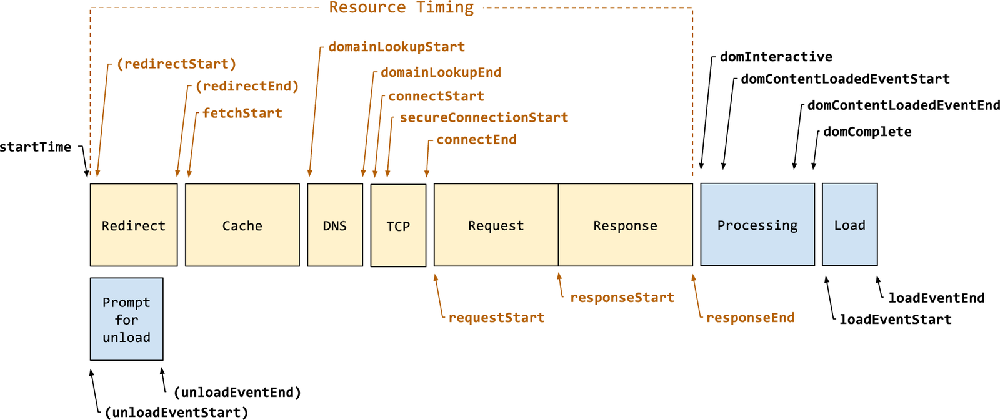

# 如何优化性能

Web性能优化点非常多，且一些优化点相互影响。根据Web程序生命周期和浏览器工作原理，可以将这些优化点划分到3个阵营：

1. 加载页面
2. 处理页面
3. 用户与页面交互

## 加载页面

> 浏览器通过HTTP协议加载页面和子资源

## 处理页面

> 浏览器将页面资源处理成页面呈现给用户

浏览器工作原理：https://www.html5rocks.com/zh/tutorials/internals/howbrowserswork/

## 用户与页面交互

> 用户向页面输入数据并得到响应

浏览器Event loops原理：https://html.spec.whatwg.org/multipage/webappapis.html#event-loops
